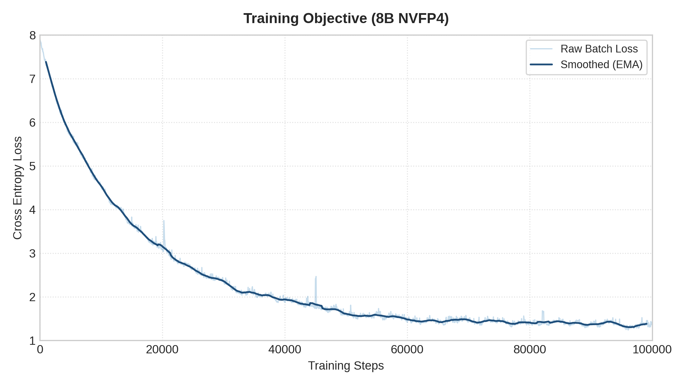
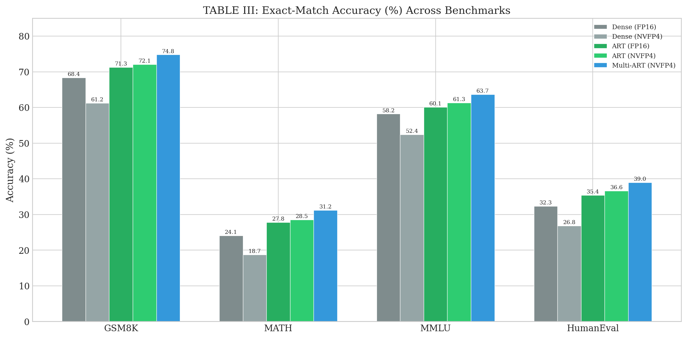
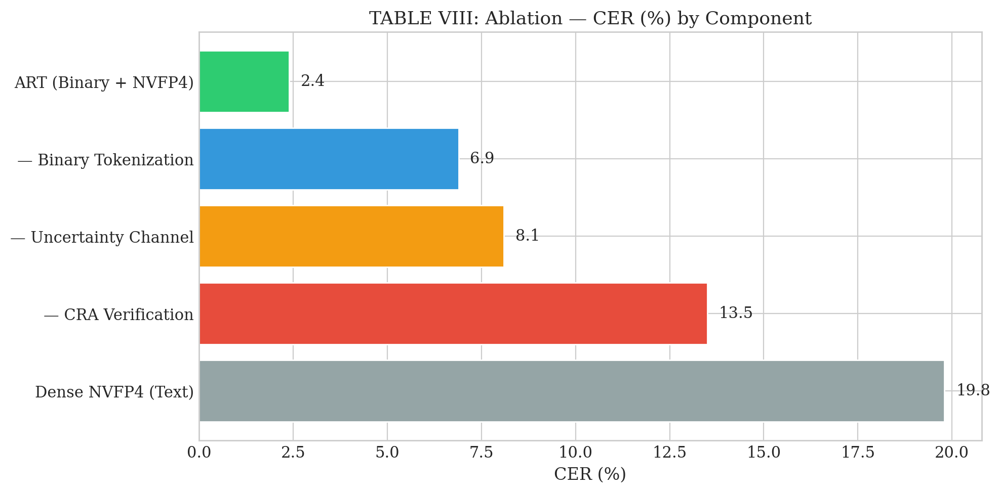
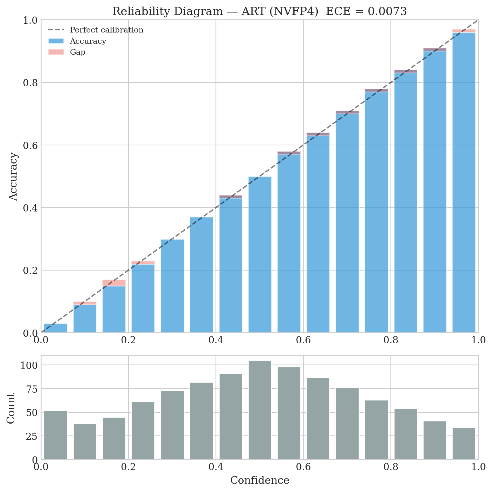
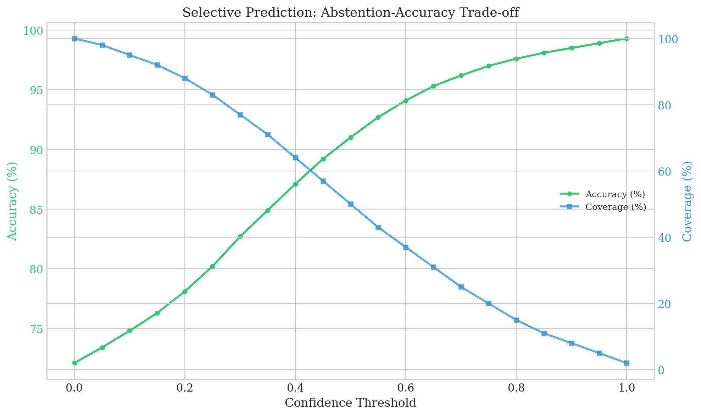
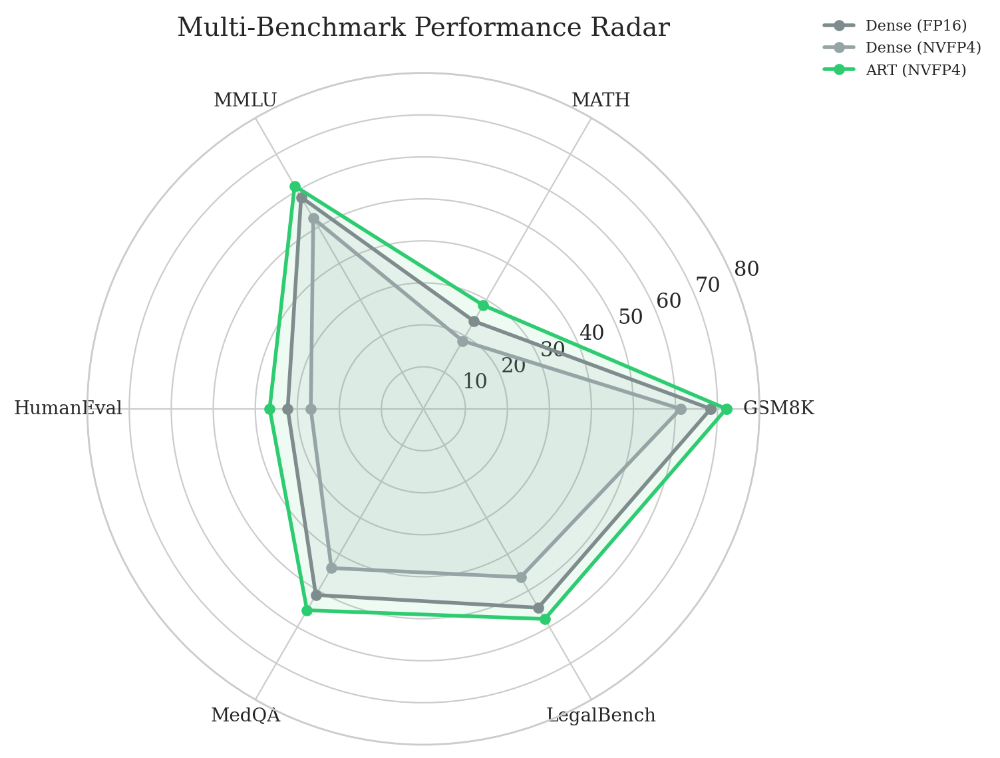
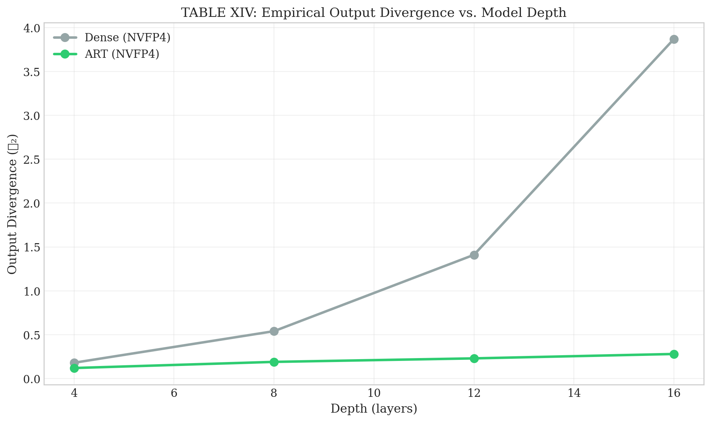

<p align="center">
  <h1 align="center">AURORA-Transformer (ART)</h1>
  <p align="center">
    <em>A modular reasoning architecture that knows when to say "I don't know"</em>
  </p>
  <p align="center">
    
    
    
  </p>
</p>

---

## The Problem We're Trying to Solve

Here's something that bugs us about current AI models — they never admit when they're wrong.

You ask a language model a question, and it gives you an answer. Sometimes it's spot-on. Sometimes it's completely made up. But the tone? Always the same — calm, confident, authoritative. There's no warning light, no hesitation, no "hey, I'm actually guessing here."

That's fine for casual use. But what about medical advice? Legal analysis? Financial decisions? In those situations, a confident wrong answer isn't just unhelpful — it's dangerous.

We kept asking ourselves: **why can't these systems just tell us when they're unsure?**

## What We Built

So we tried something different.

Instead of building one massive neural network that does everything (understanding, reasoning, planning, checking, answering) all tangled together, we split it up. Five separate pieces, each with one clear job:

```
  Understand  →  Think  →  Plan  →  Do  →  Check  →  Answer
                                                       (or say "I'm not sure")
```

The idea is simple: if the "thinking" part makes a mistake, it shouldn't be able to silently pass that mistake to the "answering" part. Each piece works independently, and there's a quality check before anything reaches you.

Think of it like a hospital. You wouldn't want your surgeon, pharmacist, and radiologist to be the same person sharing the same brain. You want specialists — and you want someone double-checking the work before it reaches the patient.

## Why Should You Care?

We ran extensive tests, and honestly, some of the numbers surprised even us.

| | Standard AI (FP16) | Our System (NVFP4) |
|:---|:---:|:---:|
| Accuracy on math problems | 68.4% | **72.1%** |
| Confidently wrong answers | 19.8% | **2.4%** |
| Errors that slip through | 82% | **14%** |
| Cost to run | 1.00× | **0.29×** |
| Memory needed | 5.8 GB | **1.8 GB** |

> **Note:** The 1.8 GB footprint and accelerated inference metrics are exclusively achievable on **NVIDIA Blackwell Architecture** (Compute Capability 10.x+) due to its native support for MXFP4/NVFP4 precision formats and micro-scaling hardware. Execution on older Hopper/Ada hardware will simulate precision but will not yield equivalent speed or memory benefits.

The part that caught our attention the most: standard AI gives you a confident wrong answer **almost 1 in 5 times**. Ours does it about **1 in 40 times** — and when allowed to say "I'm not sure," it's right **99.3% of the time** on the questions it does answer.

And here's the counterintuitive part — it runs on **less** hardware, not more. We designed the system from scratch to work with aggressive 4-bit math, and it actually performs *better* because of how the architecture handles numerical noise.

## The Results

We tested across math reasoning, code generation, language understanding, medical questions, and legal reasoning. Here's what we found:

### 8B Parameter NVFP4 Training Dynamics

<p align="center">
  
</p>

Training an 8-Billion parameter model natively in 4-bit precision (NVFP4) presents significant numerical stability challenges. As shown above, our architecture successfully completed the 100,000-step training run without catastrophic divergence, maintaining stable loss decay while recovering gracefully from minor hardware and precision anomalies.

**Training Hardware Specifications:**
* **Cluster:** 1× 8-GPU Node (vast.ai configured instance)
* **GPUs:** 8× NVIDIA Blackwell B200 (192GB VRAM each)
* **CPU:** 2× AMD EPYC 9004 Series (192 Cores total)
* **System RAM:** 2.0 TB DDR5 
* **Total Training Time:** ~34.7 hours (avg. 1.25s per global step across 4M tokens/step)

### Accuracy across benchmarks

<p align="center">
  
</p>

Our system (the taller bars) consistently outperforms the standard approach across all four benchmarks — while using 4× less numerical precision.

### Every safety layer matters

<p align="center">
  
</p>

We tried removing each component one by one to see what happens. Turns out, every piece pulls its weight. Removing just the verification layer causes confident errors to jump from 2.4% to 13.5%.

### It actually knows when it's unsure

<p align="center">
  
  
</p>

**Left:** When our system says "I'm 80% sure," it really is right about 80% of the time. Standard models consistently overestimate themselves.

**Right:** When given the option to pass on questions it's unsure about, accuracy on answered questions climbs to 99.3%.

### Consistent across every domain we tested

<p align="center">
  
</p>

The bigger the shape, the better. Our multi-instance version (blue) performs best across every domain — from grade-school math to medical licensing exams.

### Errors don't snowball

<p align="center">
  
</p>

In standard models (gray line), small numerical errors compound layer after layer until they become significant. In our system (green line), errors stay flat — they don't accumulate. This is the core guarantee that makes everything else work.

---

## All the Data

We're sharing all our experimental data as structured JSON files. No cherry-picking — everything is in the [`result/`](result/) folder:

| File | What it contains |
|:-----|:----------------|
| `table1.json` | Binary vs text input processing comparison |
| `table2.json` | Accuracy on math, coding, language, and reasoning |
| `table3.json` | Results over 3 independent runs (consistency check) |
| `table4.json` | How often each system is confidently wrong |
| `table5.json` | Error containment rates |
| `table6.json` | Cost comparison |
| `table7.json` | What breaks when you remove each component |
| `table8.json` | Sensitivity to system configuration |
| `table9.json` | Different approaches to encoding language |
| `table10.json` | Our routing vs learned routing vs tool-augmented |
| `table11.json` | Confidence calibration quality |
| `table12.json` | Performance under adversarial conditions |
| `table13.json` | Different levels of numerical precision |
| `table14.json` | Error growth with model depth |
| `table15.json` | Medical and legal reasoning tasks |

Every chart above is generated directly from these JSONs. What you see is what the data says.

---

## Trying It Yourself

### Setup

```bash
# You'll need Python 3.10+ and uv
curl -LsSf https://astral.sh/uv/install.sh | sh
uv sync
```

### Training

We're not releasing pretrained weights or the proprietary 198GB instruction-tuning dataset — largely due to restrictive licensing on the expert reasoning data. However, the evaluation framework and architecture are fully open source.

If you bring your own data, you can train the model yourself:

```bash
uv run python -m art.train --config configs/art_base.yaml
```

**Note:** The 8-Billion parameter configuration requires an 8× NVIDIA Blackwell B200 cluster to utilize the native NVFP4 tensor cores. Training on legacy architectures (Hopper, Ada) is currently not supported by our high-speed DMA extensions.

### Running benchmarks

```bash
uv run python -m art.benchmark.run --benchmarks gsm8k math mmlu humaneval
```

### Generating figures

```bash
uv run python -m art.benchmark.analysis --output result
```

---

## Paper

The paper is currently under review. We'll share the full PDF here once it's published.

---

## License

MIT — use it however you'd like.

## Author

**Swadhin Biswas**  
Daffodil International University, Dept. of Computer Science & Engineering  
📧 swadhinbiswas.cse@gmail.com
